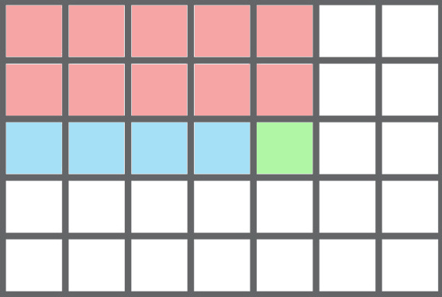

# Computing of integral noise_image

## Task:
Write a program, that takes a two-dimensional array of `unsigned char`
(non-negative integers not greater than 255).
Array size should not be bigger than 1024x1024.
The program compute the integral image, that is held in `unsigned short` (15 bites).

Provide a function that will return a sum for rectangle of size
not bigger than 16x16 for O(1) based on computed integral image.

## Example of input data (`in.txt` file):
- size of an image (`image_width` and `image_height`)
- array (`image`)
- a set of rectangular `windows` (left upper corner (`x`, `y`), `width`, `height`)
Sums should be computed for all of the given windows.
> 6 4
> 4 25 235 74 245 34
> 45 54 43 2 4 64
> 32 23 243 2 4 23
> 13 124 251 143 23 53
> 0 0 2 2
> 2 2 3 2

## Correspondent output data (`out.txt` file)
Contains the values of sum for given rectangular areas:
> 128
> 666

## Used programming language
The program was written on [Rust](https://en.wikipedia.org/wiki/Rust_(programming_language)).

You can find how to install Rust [here](https://doc.rust-lang.org/book/2018-edition/ch01-01-installation.html).

To compile and run the project, type [cargo run](https://doc.rust-lang.org/book/2018-edition/ch01-03-hello-cargo.html) from the package folder in the terminal.

## file_reader()
Reads input file described above.
Gives two-dimensional array (input matrix) and a set of rectangular windows.

## integral_image_computing()
Takes two-dimensional array (input matrix) and gives its integral image.

The algorithm is presented in the image:

To find a sum of filled rectangle (`integral_image[i][j]`) we should add
- red part (`integral_image[i - 1][j]`)
- green part (`sum_in_lines[i][j - 1]`)
- blue part (`image[i][j]`)

Green part with blue part is `sum_in_lines[i][j]`.

## window_sum()
Gives a sum of a rectangular area
by given its left top corner `x, y` and size: `width` and `height`.

The algorithm is presented in the image:

Sum in the window is a red block (image A) --
we search it (`result`).
It is equal to
- green block (image B) -- `integral_image[y + height - 1][x + width - 1]`
- minus blue block (image C) -- `integral_image[y + height - 1][x - 1]`
- minus yellow block (image D) -- `integral_image[y - 1][x + width - 1]`
- plus purple clock (image E) -- `integral_image[y - 1][x - 1]`
(because it was substracted two times)
