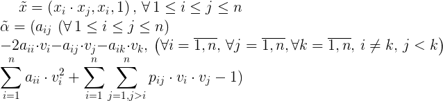

# Perceptron algorithm for splitting points by ellipse

## How to use:
Add dots to plot by button clicks:
- press left button to add a point that should be inside an ellipse -- it is blue
- press right button to add a point that should be outside an ellipse -- it is red

You can add points while ellipse has not been found yet.
Sometimes it seems that ellispe disappeared,
but it can be very big or very small, so that you can't see it in a plot --
just wait some time and it will come in sight again.
If points are not separated by any ellipse,
then you will see endless attempts to separate points with ellipse.

## Perceptron algorithm
Perceptron algorithm solves the next problem:
there are 2 point sets: .
<!-- X_1 \subset \mathbb{R}^n, \, X_2 \subset \mathbb{R}^n -->
We need to find a vector ,
<!-- \alpha -->
so that

<!-- \begin{cases}
\alpha \cdot x > 0, \, x \in X_1\\
\alpha \cdot x < 0, \, x \in X_2
\end{cases} -->

We need to find a hyperplane that separates sets and is given by vector
.

Algorithm: as an initial approximation 
is considered as a zero vector.
Rules fot cerrection of  vector on step t:

The algorithm is suitable only for point sets that are linearly separable.
Otherwise it will work endlessly trying to find a line (or hyperplane)
that separates sets.

To solve the problem with the help of perceptron algorithm we need to pass
into a space of greater dimension than the original,
where given sets can be separated by a hyperplane.

## Ellipsoid equation

<!-- \left(\vec{x} - \vec{v} \right ) \cdot A \cdot \left(\vec{x} - \vec{v} \right )^T = 1 -->

where A is a [positive-definite matrix](https://en.wikipedia.org/wiki/Positive-definite_matrix),
v is a center of an ellipse.

## Vectors in new space for 2D
Ellipse equation in 2d:

<!-- \begin{bmatrix}
x_1 - v_1 & x_2 - v_2
\end{bmatrix} \cdot
\begin{bmatrix}
a_{11} & \frac{a_{12}}{2} \\
\frac{a_{12}}{2} & a_{22}
\end{bmatrix} \cdot
\begin{bmatrix}
x_1 - v_1 \\
x_2 - v_2
\end{bmatrix} = 1 -->

After multiplication:

<!-- \begin{bmatrix}
x_1 - v_1 & x_2 - v_2
\end{bmatrix} \cdot
\begin{bmatrix}
a_{11} & \frac{a_{12}}{2} \\
\frac{a_{12}}{2} & a_{22}
\end{bmatrix} \cdot
\begin{bmatrix}
x_1 - v_1 \\
x_2 - v_2
\end{bmatrix} = 1 -->

After multiplication and brace expansion we obtain new vectors:

<!-- \tilde{x} = \left(x_1^2, \, x_2^2, \, x_1, \, x_2, \, x_1 \cdot x_2, \, 1 \right )\\
\tilde{\alpha} = (a_{11}, \, a_{22}, -2v_1 \cdot a_{11} - c_2 \cdot a_{12},
-2v_2\cdot a_{22} - v_1 \cdot a_{12},\\
v_1^2 \cdot a_{11} + v_2^2 \cdot a_{22} + v_1 \cdot v_2 \cdot a_{12} - 1 ) -->

## Vectors in new space for a general case
New vectors:

<!-- \tilde{x} = \left(x_i^2, x_i \cdot x_j, x_i, 1 \right ) \\
\tilde{\alpha} = \left(a_{ii}, a_{ij}, -2a_{ii} \cdot v_i - a_{ij} \cdot v_j - a_{ik} \cdot v_k, \sum \limits_{i = 1}^n a_{ii} \cdot v_i^2 + \sum \limits_{i = 1}^n \sum \limits_{j = 1, j > i}^n p_{ij} \cdot v_i \cdot v_j - 1\right ) -->

These new vectors are used in perceptron algorithms.
