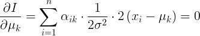
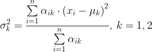

# Expectation maximization algorithm

There are two one-dimensional normal distributions (two samples of two classes):

<!-- f\left(x_i, \theta_k \right ) =
f\left(x_i, \mu_k, \sigma_k^2 \right )=
\frac{1}{\sqrt{2\pi} \cdot \sigma_k} \cdot
\exp^{-\frac{\left(x_i - \mu_k \right )^2}{2\sigma_k^2}}, \,
i = \overline{1, n} -->

for all classes (k = 1, 2).

Parameters of distributions are unknown, as well as
- a posteriori probabilities that observation i belongs to a class k

<!-- \alpha_{ik}, \, i = \overline{1, n} , \, k = 1, 2 -->
- and prior probabilities of classes

<!-- q_k, \, k = 1, 2 -->

We want to find such distributions that maximize probability of observation

<!-- p\left(X \right ) =
\prod \limits_{i = 1}^n p\left(x_i \right ) =
\prod \limits_{i = 1}^n
\left[ p \left(x \; \middle| \; 1 \right ) \cdot p \left(1 \right ) + p \left(x \; \middle| \; 2 \right ) \cdot p \left(2 \right )\right ] = \\
= \prod \limits_{i = 1}^n
\left[ q_1 \cdot f \left( x_i; \theta_1 \right ) + q_2 \cdot f\left(x_i; \theta_2 \right ) \right] -->

To move from a product to a sum by taking a logarithm

<!-- \ln p\left(X \right ) =
\sum\limits_{i = 1}^n
\ln\left[ q_1 \cdot f \left( x_i; \theta_1 \right ) + q_2 \cdot f\left(x_i; \theta_2 \right ) \right] -->

This is a likelihood that should be maximized.

## Algorithm

The algorithm works step by step.
Firstly,

are generated randomly and then all parameters are improved by the next rules:

<!-- \begin{cases}
q_k = \frac{1}{n} \sum\limits_{i=1}^n \alpha_{ik}, \, k \in K = \left\{1, 2\right\} \\
\theta_k = \arg\max\limits_{\theta} \sum\limits_{i=1}^n \alpha_{ik} \cdot \log f\left(x_i;\theta_k \right ), \, k \in K = \left\{ 1, 2 \right\} \\
\alpha_{ik} = \frac{q_k \cdot f \left(x_i; \theta_k \right )}{\sum\limits_{k\in K}q_k \cdot f\left(x_i;\theta_k \right )}, \, k \in K=\left\{1, 2\right\}
\end{cases} -->

It is one step of EM algorithm.
This step should be repeated to maximize a likelihood.

It is possible to find explicit expressions for updating parameters

<!-- \theta_k =
\left(\mu_k, \sigma_k^2 \right ) =
\arg\max\limits_{\left(\mu, \sigma^2 \right)} \left[ \sum \limits_{i=1}^n \alpha_{ik} \cdot \log \left(\frac{1}{\sqrt{2\pi} \cdot \sigma} \right ) - \sum \limits_{i=1}^n \alpha_{ik} \cdot \frac{\left(x_i - \mu \right)^2}{2\sigma^2} \right ] -->

Lets mark the expression that we maximize here in square brackets with I.
Then expected value can be found from

<!--  \frac{\partial I}{\partial \mu_k} =
\sum\limits_{i=1}^n \alpha_{ik} \cdot \frac{1}{2\sigma^2} \cdot 2\left(x_i - \mu_k \right ) = 0 -->

Then an expected value is

<!--  \mu_k =
\frac{\sum\limits_{i=1}^n \alpha_{ik} \cdot x_i}{\sum\limits_{i=1}^n \alpha_{ik}}, \,
k = 1,2 -->

Similarly,

<!--  \frac{\partial I}{\partial \sigma_k} = -\sum \limits_{i=1}^n \alpha_{ik} \cdot\sqrt{2\pi} \cdot \sigma_k  \cdot \frac{1}{\sqrt{2 \pi} \cdot \sigma_k^2} + \sum\limits_{i=1}^n \alpha_{ik} \cdot \frac{\left( x_i - \mu_k \right )^2}{2\sigma_k^3} = 0 -->

Then variance is

<!--  \sigma_k^2 = \frac{\sum\limits_{i=1}^n \alpha_{ik} \cdot \left( x_i -
\mu_k \right )^2}{\sum\limits_{i=1}^n \alpha_{ik}}, \, k = 1, 2 -->

## Result

In the output you can see an image where observations are shown as vertical lines.

Their colors depends on probabilities
 and can be red, blue, or something between.
The more is a probability that an observation belongs to one class
and the less is a probability that an observation belongs to other class,
the clearer the color of an observation becomes.
If probabilities are approximately the same,
than the color of an observation is between red and blue.
